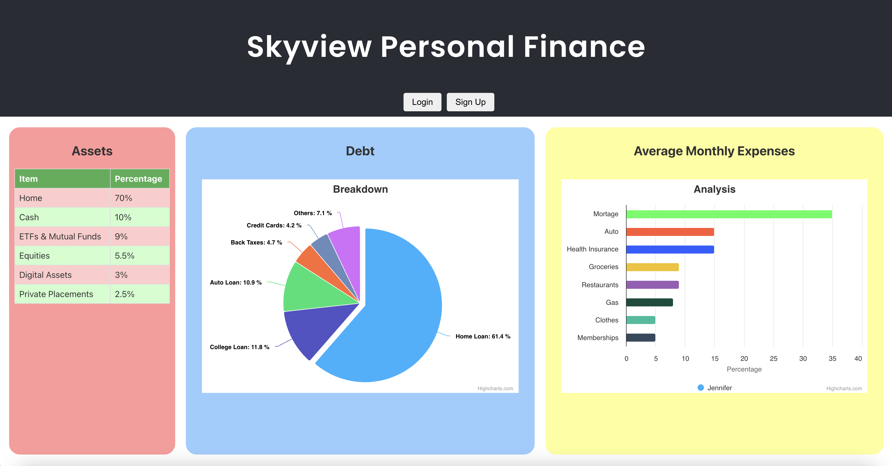

# Skyview

## Overview
This project is a simple frontend personal finance application built with React.js. It serves as a demonstration of my skills in developing user interfaces with React, including component structuring, state management, and basic routing. While the application is non-functioning in terms of backend integration or complete feature implementation, it showcases the potential structure and design of a fully functional application.




### Features

- **Component Design**: Demonstrates the use of functional components and class components (if applicable).

- **State Management**: Examples of using React's useState hook for state management within components.

- **Routing**: Utilizes React Router for navigating between different pages/views (if applicable).

- **Styling**: Shows styling approaches using CSS Modules or styled-components (whichever is used).

## Project Structure
```
project-root/
│
├── public/ # Static files
│ └── index.html
│
├── src/ # Project source files
│ ├── components/
│ ├── styles/
│ ├── App.js
│ └── index.js
│
├── package.json
├── README.md
└── package-lock.json
```

## Technologies Used
- React.js

- React Router

- CSS Modules/styled-components

- Axios and Highcharts

## Contributing
While this project is primarily a portfolio piece and not intended for further development, feedback and suggestions are welcome. Feel free to fork the repository and submit pull requests.


## License
This project is open-sourced under the MIT License. See the [LICENSE](LICENSE) file for details.
